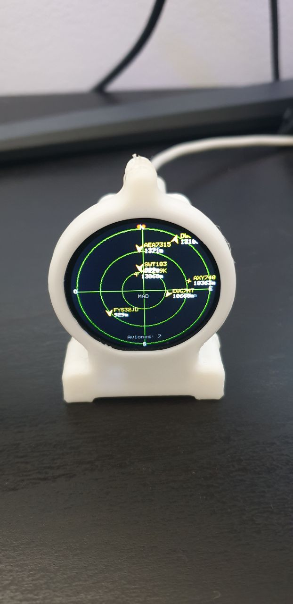
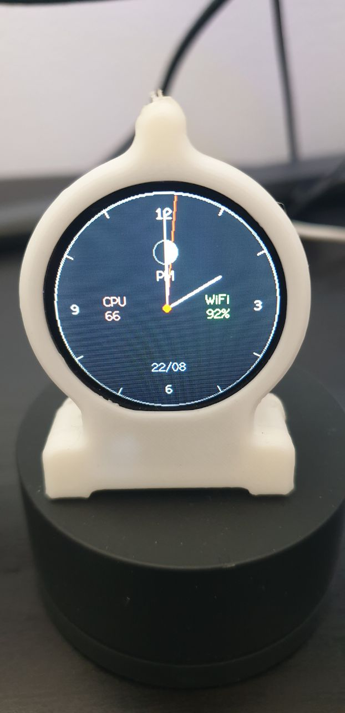
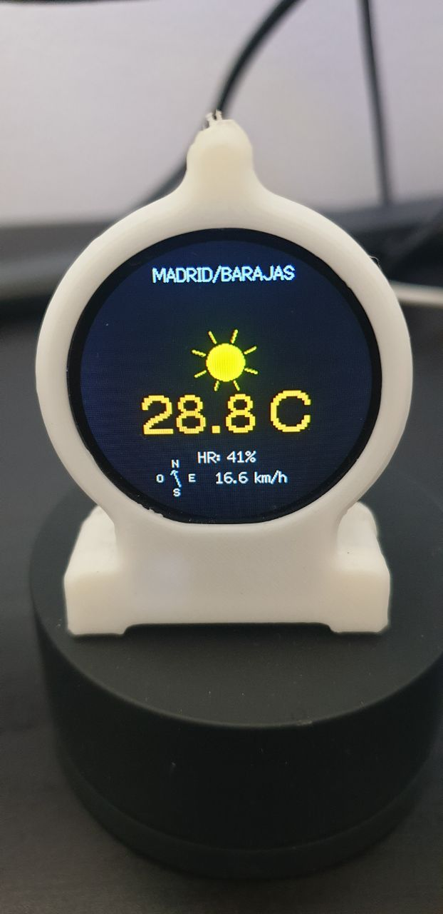
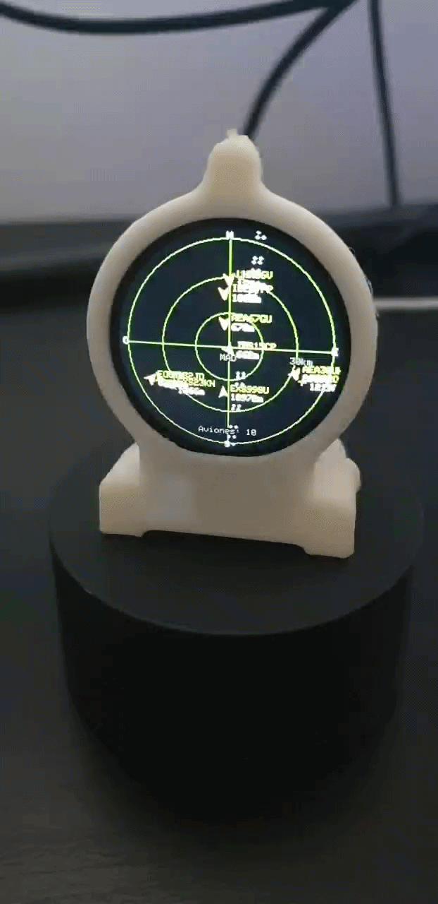

# RadarFlightsESP32 🛫

<div align="center">
  
  
  
  <br><br>
  
</div>

RadarFlightsESP32 es un proyecto de código abierto para dispositivos **ESP32** (específicamente la placa `esp32-s3-devkitm-1` con soporte para pantalla LCD `TFT_eSPI`) que actúa como un radar de vuelos de escritorio. Muestra información en tiempo real sobre los aviones cercanos usando datos públicos de [Airplanes.live](https://airplanes.live/), además de proveer pantallas de información del tiempo (vía AEMET), reloj (digital y analógico) y fase lunar.

---

## 🌟 Características Principales

* **Radar de Aviones en Tiempo Real**: Visualización estilo radar clásico dibujando las aeronaves según su distancia, altitud e identificador. Identifica helicópteros, drones, planeadores y diferentes tipos de aviones comerciales.
* **Múltiples Pantallas**:
  - 📡 **Radar**: Ubicación relativa de los aviones. Incluye un "avión fantasma" aleatorio con diferentes diseños (modelos bimotor y cuatrimotor con sus respectivas estelas) cuando no hay tráfico real o configurado.
  - 🕒 **Relojes**: 
    - Digital.
    - Analógico 12 Horas.
    - Analógico 24 Horas (con borde iluminado en las horas de sol y aguja de 24h).
  - 🌤️ **El Tiempo**: Datos meteorológicos actualizados a través de la API abierta de AEMET (requiere API Key gratuita). Cuenta con una brújula con puntos cardinales alineados para indicar la dirección exacta del viento.
  - 🌑 **Fase Lunar**: Indicador de la fase lunar actual.
  - ✈️ **Horizonte Artificial**: Indicador de actitud con animación dinámica que muestra los datos del avión más cercano (Altitud, Velocidad, Rumbo).
  - 🛰️ **ISS Tracker**: Mapa mundial con la posición en tiempo real de la Estación Espacial Internacional (ISS) y tu ubicación.
  - ☀️ **Arco Solar**: Representación gráfica de la posición del Sol durante el día con las horas de salida y puesta.
* **Portal Cautivo de Configuración**: No hay que modificar el código para cambiar las credenciales de WiFi o la ubicación. Si no detecta WiFi, levanta su propio punto de acceso (Access Point) llamado `ESP32-Radar` para configuración remota desde el móvil o navegador.
* **Auto-Localización**: Capacidad de ubicarte automáticamente según tu dirección IP para ajustar el radar.

---

## 🛠️ Requisitos de Hardware

* Un microcontrolador **ESP32-S3** (aunque puede portarse a otros ESP32 modificando el entorno en `platformio.ini`).
* Pantalla TFT compatible con la librería `TFT_eSPI` (ej. GC9A01 redonda o similares).
* **Carcasa 3D**: El diseño de la carcasa impreso en 3D que aparece en las imágenes se puede descargar gratuitamente en Printables: [Flight Radar (No soldering)](https://www.printables.com/model/1771315-flight-radar-no-soldering)

---

## 💻 Instalación y Compilación (PlatformIO)

El proyecto está diseñado para ser compilado utilizando **PlatformIO**.

1. Instala [Visual Studio Code](https://code.visualstudio.com/) y la extensión de [PlatformIO](https://platformio.org/install/ide?install=vscode).
2. Clona o descarga este repositorio y ábrelo en VS Code.
3. El archivo `platformio.ini` ya está configurado para la placa `esp32-s3-devkitm-1`.
4. Conecta tu placa ESP32 por USB y haz clic en el botón **Upload** (Subir) en la barra inferior de PlatformIO (o usa el comando `pio run -t upload -e esp32-s3-devkitm-1`).

---

## 📦 Instalación desde un Release (Sin compilar)

Si no quieres instalar PlatformIO ni compilar el código, puedes instalar directamente la última versión precompilada desde la sección de **Releases** en GitHub.

### 1. La primera vez (Instalación desde cero por USB)
Al ser la primera vez, el ESP32-S3 está "vacío" o tiene otro firmware, por lo que es necesario grabar tanto el programa como el gestor de arranque y la tabla de particiones.
La forma más sencilla es usar **[ESP Web Tools](https://espressif.github.io/esptool-js/)** (flasheo directo desde navegadores web como Chrome/Edge) o **[Espressif Flash Download Tools](https://www.espressif.com/en/support/download/other-tools)** (Windows).

Los archivos binarios descargados del Release deben colocarse en las siguientes direcciones de memoria (*offsets*):
* `0x0000` -> `bootloader.bin`
* `0x8000` -> `partitions.bin`
* `0x10000` -> `firmware.bin`

**Comando manual usando esptool (para usuarios avanzados):**
```bash
esptool.py --chip esp32s3 --baud 460800 write_flash -z 0x0000 bootloader.bin 0x8000 partitions.bin 0x10000 firmware.bin
```

### 2. Actualizaciones posteriores (OTA o Cable)
Para futuras versiones, la tabla de particiones y el bootloader ya estarán instalados. **Solo hace falta actualizar el archivo `firmware.bin`**.

**Opción A: Vía OTA (Web/WiFi - Recomendado)**
1. Accede a la ruta `/update` usando la dirección IP de tu Radar en el navegador (ej. `http://192.168.X.X/update`).
2. Selecciona el nuevo archivo **`firmware.bin`** descargado del Release.
3. Pulsa en actualizar. El dispositivo se reiniciará con la nueva versión sin necesidad de cables.

**Opción B: Por cable USB**
Si por algún motivo necesitas actualizar por cable, graba únicamente el firmware en `0x10000`:
```bash
esptool.py --chip esp32s3 --baud 460800 write_flash -z 0x10000 firmware.bin
```

---

## ⚙️ Configuración (Primer Uso)

1. Al iniciar por primera vez (o si no puede conectarse a un WiFi conocido), la pantalla mostrará un mensaje indicando el **MODO CONFIGURACIÓN**.
2. Desde tu teléfono u ordenador, busca redes WiFi y conéctate a la red llamada **`ESP32-Radar`**.
3. Una vez conectado, abre el navegador web y ve a la dirección: `http://1.2.3.4`
4. Rellena los datos en el portal web:
   * **WiFi**: Nombre y contraseña de tu red de internet.
   * **Ubicación**: Puedes auto-localizarte por IP, elegir un aeropuerto famoso o meter coordenadas manuales. Selecciona también el rango en KM.
   * **El Tiempo (AEMET)**: Pega tu [API Key gratuita de AEMET](https://opendata.aemet.es/centrodedescargas/altaUsuario?) para ver los datos del clima.
   * **Hora y Fecha**: Ajusta tu zona horaria y horario de verano.
   * **Ajustes Visuales**: Escoge cuántos aviones máximos mostrar, su color y el **Modo de Reloj** (puedes hacer que los relojes vayan alternándose, o fijar uno en concreto como el de 24 Horas).
5. Haz clic en **Guardar y Reiniciar**. ¡El radar se conectará y empezará a funcionar!

> **Restablecimiento de Fábrica**: Si deseas borrar toda la configuración (por ejemplo, cambias de casa o de red de internet) puedes mantener pulsado el botón **BOOT** de la placa mientras se enciende o se reinicia. Esto borrará la memoria NVS y volverá al punto de acceso.

---

## 📺 Descripción de las Pantallas

El dispositivo va ciclando entre diferentes pantallas de forma automática, aunque puedes forzar el cambio de pantalla de forma manual pulsando el botón **BOOT**. Las pantallas disponibles son:

1. **Pantalla de Radar**: Muestra la ubicación de los aviones, helicópteros y otras aeronaves alrededor de tu ubicación, indicando su altitud, distancia y código de vuelo, con una interfaz estilo radar clásico.
2. **Relojes**:
   - **Digital**: Reloj estándar en formato HH:MM.
   - **Analógico 12h**: Esfera clásica con manecillas de horas, minutos y segundos.
   - **Analógico 24h**: Esfera especial de 24 horas con borde iluminado en amarillo durante las horas de luz solar.
   *Nota: Puedes configurar desde el portal web si quieres que los distintos relojes alternen o fijar uno específico.*
3. **El Tiempo (AEMET)**: Pantalla de información meteorológica con la temperatura actual, humedad, y viento extraída directamente de AEMET.
4. **Fase Lunar**: Muestra gráficamente la luna con su fase actual, iluminada acorde a los días del ciclo lunar.
5. **Horizonte Artificial**: Pantalla inspirada en la aviónica que muestra los datos del avión más cercano de forma inmersiva, con etiquetas dinámicas y movimiento.
6. **ISS Tracker**: Rastreador de la Estación Espacial Internacional sobre un mapa de los continentes, indicando la distancia exacta hasta tu casa.
7. **Arco Solar**: Arco que dibuja la posición del sol a lo largo del día.

---

## 🔘 Botones BOOT y RESET

Tu placa ESP32 cuenta con dos botones físicos integrados que tienen funciones importantes en el funcionamiento del radar:

* **Botón RESET (o EN)**: 
  - Al pulsarlo en cualquier momento, el microcontrolador se reinicia (Hard Reset) de forma inmediata.
* **Botón BOOT (o 0)**:
  - **Pulsación corta (durante el funcionamiento normal)**: Avanza manualmente a la siguiente pantalla (Radar -> Relojes -> El Tiempo -> Luna -> Radar).
  - **Mantener pulsado (durante el arranque o reinicio)**: Realiza un *Restablecimiento de Fábrica* (Factory Reset). Borra toda la configuración guardada (credenciales WiFi, coordenadas, API Key) en la memoria no volátil y vuelve a levantar el Portal Cautivo `ESP32-Radar` para configurar el dispositivo desde cero.

---

## 🔌 Cableado (Pinout)

Si estás construyendo el proyecto montando tu propia placa ESP32-S3 y la pantalla TFT (como una GC9A01 SPI redonda), estas son las conexiones predeterminadas en el proyecto:

| Pin Pantalla | Función SPI | Pin ESP32-S3 (por defecto) |
|--------------|-------------|----------------------------|
| **VCC**      | Alimentación| 3.3V                       |
| **GND**      | Tierra      | GND                        |
| **DIN / SDA**| MOSI        | GPIO 11                    |
| **CLK / SCL**| SCLK        | GPIO 12                    |
| **CS**       | Chip Select | GPIO 9                     |
| **DC / RS**  | Data/Command| GPIO 8                     |
| **RST / RES**| Reset       | GPIO 7                     |
| **BLK / LED**| Backlight   | 3.3V (Opcional, para luz)  |

*(Nota: Estos pines de conexión se pueden modificar libremente ajustando la sección de `build_flags` en el archivo `platformio.ini`).*

---

## 📁 Estructura del Código

El proyecto está organizado en múltiples archivos dentro de la carpeta `src/` para facilitar su modificación:

- `main.cpp`: Inicialización principal (`setup`) y máquina de estados general (`loop`).
- `globals.h/cpp`: Almacena y gestiona las variables globales, configuraciones y variables de estado.
- `display.h/cpp`: Maneja todo el pintado en pantalla (radar, relojes, iconos, animaciones).
- `api.h/cpp`: Conexiones HTTPS y procesamiento JSON (API de aviones ADSB y clima AEMET).
- `math_utils.h/cpp`: Lógicas matemáticas (coordenadas polares, conversión de unidades, cálculo lunar).
- `web_server.h/cpp`: Controla el portal cautivo y la web de configuración.

---

## 📝 Notas y Agradecimientos

- Datos de vuelos gracias a la estupenda comunidad de **[Airplanes.live](https://airplanes.live/)**.
- Datos meteorológicos extraídos de **AEMET OpenData**.
- Interfaz gráfica operada por la rápida librería **TFT_eSPI** de Bodmer.

*Desarrollado y refactorizado por Freseco (2026).*
